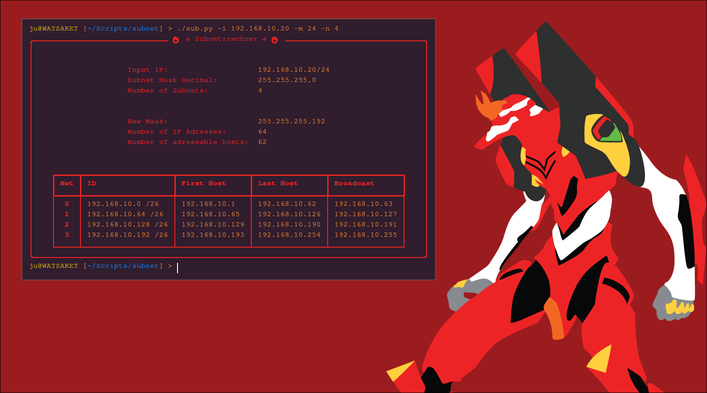

# Subnetzrechner
## Justin Ackermann FS 11.02

**Subnet Calculator for the GLN in LF08**

*<p>To correctly display this file, please use a program to display markdown files,
for example the Chrome or VSCode Plugin "Markdown Preview",
or use a Markdown Preview/Editor in the www. </p>*



## Installation

Ensure python is installed.
Only one package is needed for this. Install via pip

```bash
pip install rich
```

## Usage

```bash
./sub.py -i IP_ADRESS -m NETMASK -n AMOUNT_OF_SUBNETS (-j JSON_DUMP_FILENAME)
```

**IP_ADRESS** = Net-ID or Client-IP in decimal dotted notation, (e.g. 192.168.10.10)

**NETMASK** = Subnetmask of current net in CIDR notation (eg. 24)

**AMOUNT_OF_SUBNETS** = Amount of subnets to divide the current net into. 

**JSON_DUMP** = Optional. Value after -j is filename for the json dump, e.g. dump.json - If only -j is passed, filename will be output.json

## Examples
### Example 1
#### Input
```py
./sub.py -i 192.168.10.0 -m 24 -n 4
# We have a /24 net (256 IP Adresses) and want to divide this into 4 subnets.
```

#### Output
```bash
╭────────────────────────────────────────── 🔥 » Subnetzrechner « 🔥 ──────────────────────────────────────────╮
│                                                                                                              │
│                                                                                                              │
│                                Input IP:                    192.168.10.10/24                                 │
│                                Subnet Mask Decimal:         255.255.255.0                                    │
│                                Number of Subnets:           4                                                │
│                                                                                                              │
│                                                                                                              │
│                                New Mask:                    255.255.255.192                                  │
│                                Number of IP Adresses:       64                                               │
│                                Number of adressable hosts:  62                                               │
│                                                                                                              │
│                                                                                                              │
│                 ┏━━━━━┳━━━━━━━━━━━━━━━━┳━━━━━━━━━━━━━━━━┳━━━━━━━━━━━━━━━━┳━━━━━━━━━━━━━━━━┓                  │
│                 ┃ Net ┃ ID             ┃ First Host     ┃ Last Host      ┃ Broadcast      ┃                  │
│                 ┡━━━━━╇━━━━━━━━━━━━━━━━╇━━━━━━━━━━━━━━━━╇━━━━━━━━━━━━━━━━╇━━━━━━━━━━━━━━━━┩                  │
│                 │  0  │ 192.168.10.0   │ 192.168.10.1   │ 192.168.10.62  │ 192.168.10.63  │                  │
│                 │  1  │ 192.168.10.64  │ 192.168.10.65  │ 192.168.10.126 │ 192.168.10.127 │                  │
│                 │  2  │ 192.168.10.128 │ 192.168.10.129 │ 192.168.10.190 │ 192.168.10.191 │                  │
│                 │  3  │ 192.168.10.192 │ 192.168.10.193 │ 192.168.10.254 │ 192.168.10.255 │                  │
│                 └─────┴────────────────┴────────────────┴────────────────┴────────────────┘                  │
╰──────────────────────────────────────────────────────────────────────────────────────────────────────────────╯
```

### Example 2

#### Input
```py
./sub.py -i 172.13.20.3 -m 23 -n 8 -j 'cool_subnets.json'
# We have a /23 net and want to divide this into 8 subnets. Output should be stored as json in the file cool_subnets.json
```

#### Output
```py
╭─────────────────────────────────────── 🔥 » Subnetzrechner « 🔥 ────────────────────────────────────────╮
│                                                                                                         │
│                                                                                                         │
│                              Input IP:                    172.13.20.3/23                                │
│                              Subnet Mask Decimal:         255.255.254.0                                 │
│                              Number of Subnets:           8                                             │
│                                                                                                         │
│                                                                                                         │
│                              New Mask:                    255.255.255.192                               │
│                              Number of IP Adresses:       64                                            │
│                              Number of adressable hosts:  62                                            │
│                                                                                                         │
│                                                                                                         │
│               ┏━━━━━┳━━━━━━━━━━━━━━━━━━━┳━━━━━━━━━━━━━━━┳━━━━━━━━━━━━━━━┳━━━━━━━━━━━━━━━┓               │
│               ┃ Net ┃ ID                ┃ First Host    ┃ Last Host     ┃ Broadcast     ┃               │
│               ┡━━━━━╇━━━━━━━━━━━━━━━━━━━╇━━━━━━━━━━━━━━━╇━━━━━━━━━━━━━━━╇━━━━━━━━━━━━━━━┩               │
│               │  0  │ 172.13.20.0 /26   │ 172.13.20.1   │ 172.13.20.62  │ 172.13.20.63  │               │
│               │  1  │ 172.13.20.64 /26  │ 172.13.20.65  │ 172.13.20.126 │ 172.13.20.127 │               │
│               │  2  │ 172.13.20.128 /26 │ 172.13.20.129 │ 172.13.20.190 │ 172.13.20.191 │               │
│               │  3  │ 172.13.20.192 /26 │ 172.13.20.193 │ 172.13.20.254 │ 172.13.20.255 │               │
│               │  4  │ 172.13.21.0 /26   │ 172.13.21.1   │ 172.13.21.62  │ 172.13.21.63  │               │
│               │  5  │ 172.13.21.64 /26  │ 172.13.21.65  │ 172.13.21.126 │ 172.13.21.127 │               │
│               │  6  │ 172.13.21.128 /26 │ 172.13.21.129 │ 172.13.21.190 │ 172.13.21.191 │               │
│               │  7  │ 172.13.21.192 /26 │ 172.13.21.193 │ 172.13.21.254 │ 172.13.21.255 │               │
│               └─────┴───────────────────┴───────────────┴───────────────┴───────────────┘               │
╰─────────────────────────────────────────────────────────────────────────────────────────────────────────╯
``` 

#### Output of cool_subnets.json

```json
{
   "old_mask":"255.255.254.0",
   "new_mask":"255.255.255.192",
   "new_cidr":26,
   "ip_adresses":64,
   "hosts":62,
   "nets":{
      "0":{
         "id":"172.13.20.0",
         "broadcast":"172.13.20.63",
         "first_host":"172.13.20.1",
         "last_host":"172.13.20.62"
      },
      "1":{
         "id":"172.13.20.64",
         "broadcast":"172.13.20.127",
         "first_host":"172.13.20.65",
         "last_host":"172.13.20.126"
      },
      "2":{
         "id":"172.13.20.128",
         "broadcast":"172.13.20.191",
         "first_host":"172.13.20.129",
         "last_host":"172.13.20.190"
      },
      "3":{
         "id":"172.13.20.192",
         "broadcast":"172.13.20.255",
         "first_host":"172.13.20.193",
         "last_host":"172.13.20.254"
      },
      "4":{
         "id":"172.13.21.0",
         "broadcast":"172.13.21.63",
         "first_host":"172.13.21.1",
         "last_host":"172.13.21.62"
      },
      "5":{
         "id":"172.13.21.64",
         "broadcast":"172.13.21.127",
         "first_host":"172.13.21.65",
         "last_host":"172.13.21.126"
      },
      "6":{
         "id":"172.13.21.128",
         "broadcast":"172.13.21.191",
         "first_host":"172.13.21.129",
         "last_host":"172.13.21.190"
      },
      "7":{
         "id":"172.13.21.192",
         "broadcast":"172.13.21.255",
         "first_host":"172.13.21.193",
         "last_host":"172.13.21.254"
      }
   }
}
``` 